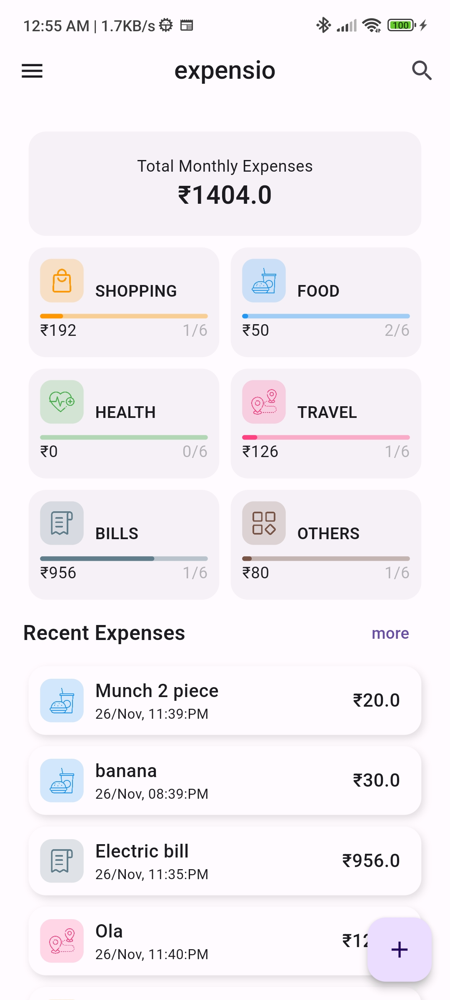
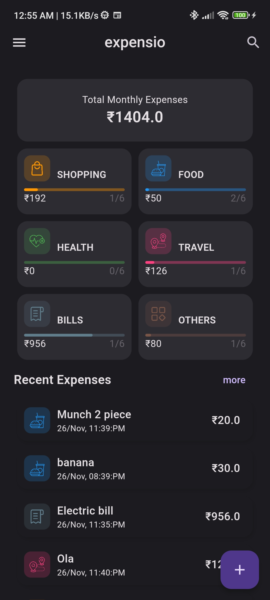
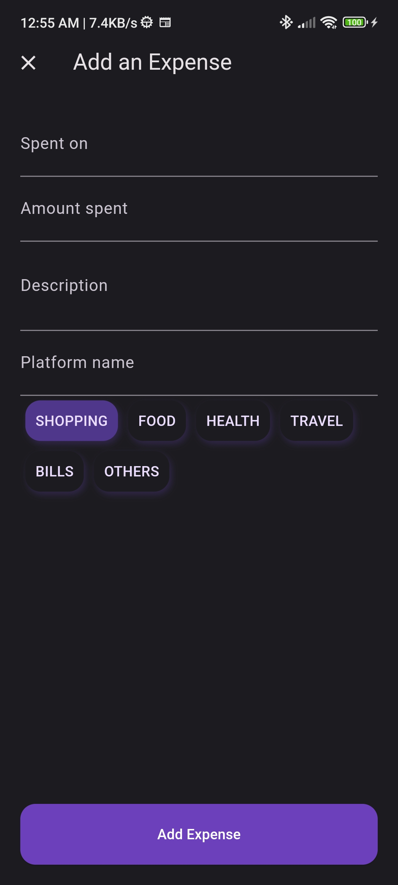
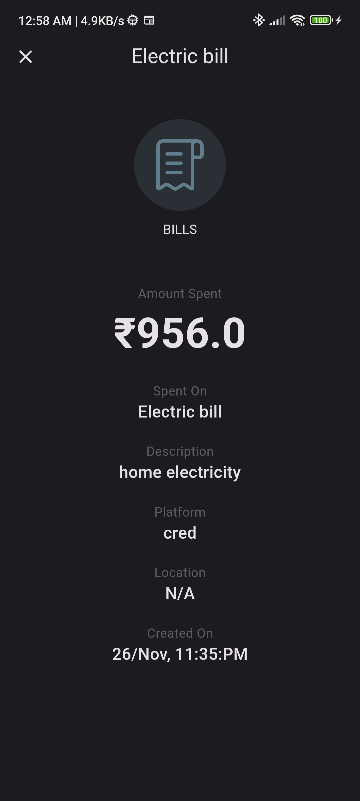
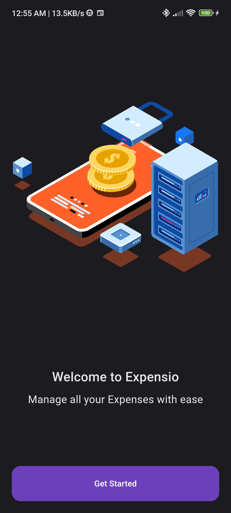
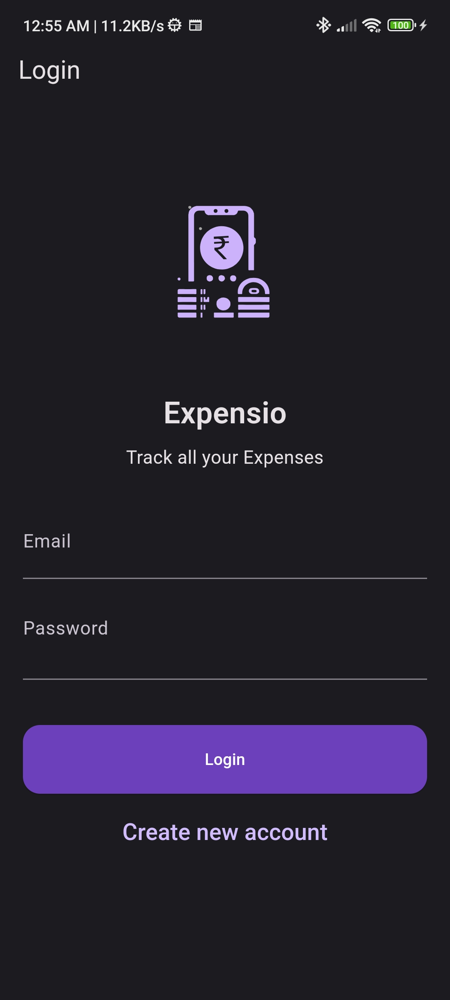
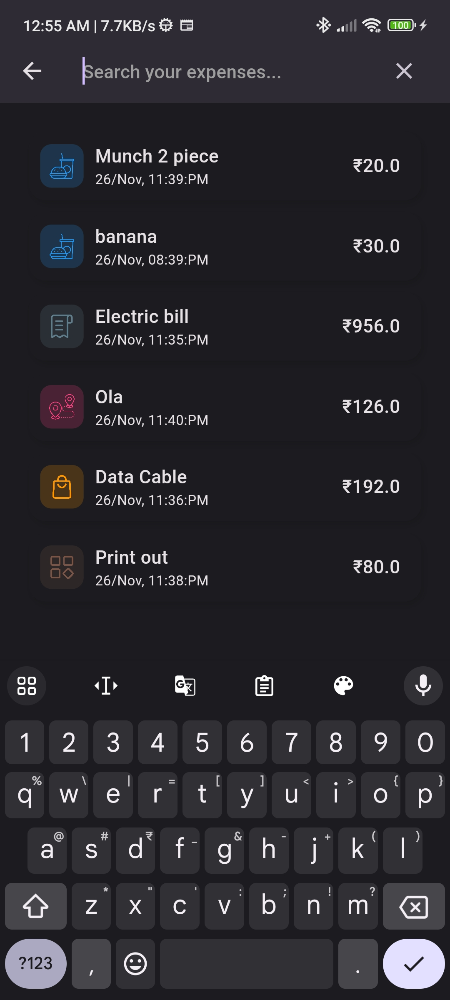
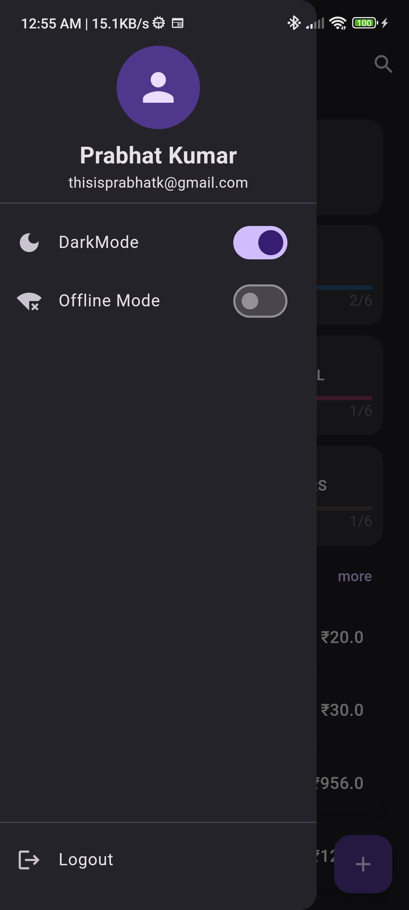

# expensio

An Expense Tracker app, Expensio built using flutter with firebase and hive db.

-   User can login to the app
-   User can switch between local db and firebase cloud db
-   User can switch between darkMode and lightMode

## ScreenShots

